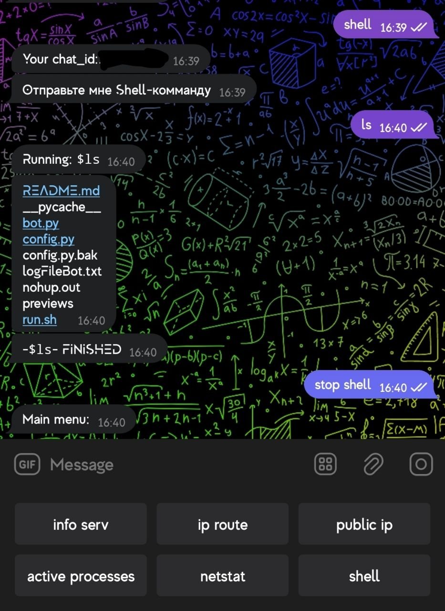

# Bot Bounty


Python Script for Telegram Bot is specially builded for pentest & bug bounty. It's like a telegram shell.

You will be notified when your task(command line) is finished with results. This bot make long time tasks by you, taking off the need of your attention if it's finished.


## Preview 👀

|||
|||
||

## Getting Started

* Developed with Python 3.8.5


### 🔨 Prerequisites

You need to install the Python Telegram bot api used for this bot(pyTelegramBotAPI).

```shell
$ pip3 install pyTelegramBotAPI
```

### 🥾 Steps to run your bot 🥾

Create a bot with [@botfather](https://t.me/botfather) and replace the API Token gaven by @botfather in the script `config.py` at line 2:

```python
TOKEN = 'XXXXXX:XXXXXXXXXXXXXXXX'
```

At same file(`config.py`) add the ID number(s) of the user(s) who is/are authorized at line 4:

```python
authorizedUsers = [123456789, 987654321]
```

to know which is your User ID go to [@userinfobot](https://t.me/userinfobot)

Now just run the script:
```shell
$ python3 bot.py
```

## Tip

**If your output is too large, you should save it in a file with no output.**

E.g.:
- ```\nmapadv example.com > resultScan.txt```
- ```\nmapadv example.com -oN resultScan.txt```
- ```\exec echo 'awesome bot!' > yesItIs.txt```


## Available commands

```bash
├── /start             # starts/reset the bot
│   └── Main Menu      # keyboard personalized options
│       ├── info serv
│       │   ├── Temp   # temperature of your device
│       │   ├── Hard Disk Space
│       │   ├── RAM    # info of your RAM
│       │   └── CPU    # Usage of your CPU
│       ├── ip route
│       ├── public ip
│       ├── active processes
│       ├── netstat    # by services
│       └── shell        # enter shell mode
├── /exec   # execute a command line that you give E.g.:
│           # /exec echo 'awesome bot!')
├── /amassenum  # /amassenum example.com -> $ amass enum -d example.com
├── /nmapadv    # /nmapadv example.com -> $ nmap -sC -sV -Pn -p-
└── /help    # show list of commands avaibles
```


## 🎥 Security Logger

There is a `logFileBot.txt` file where will log all commands sended by user(s). In addition, if it's the case someone trying to use your bot without your authorization.


## Author

* Drayko Esobar - If you like my work, please...<a href="https://www.buymeacoffee.com/drayko" target="_blank"></a>

## Contributors 🤘🏼

* no one until now... You can be here! :D Open to **new commands**, suggests, changes or improvements.

## License

This project is licensed under the GNU General Public License v3.0

## Acknowledgments

* To [Va5c0](https://github.com/Va5c0/), for his previus work.

